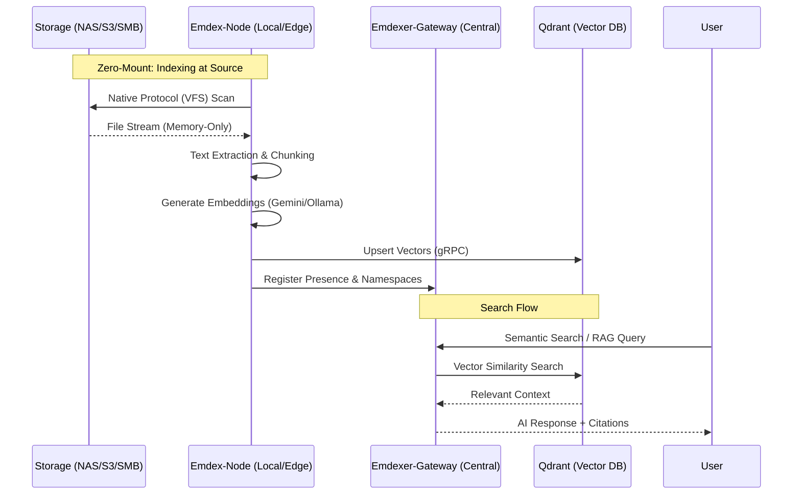

#  Emdexer

**Distributed RAG Engine for Filesystem Intelligence.**  
*Turn any NAS, SMB share, S3 bucket, or local disk into a secure, semantic AI knowledge base.*

[](https://go.dev/)
[](https://github.com/piotrlaczykowski/emdexer/actions)
[](LICENSE)
[](CONTRIBUTING.md)

[**Getting Started**](docs/getting-started/installation.md) | [**API Reference**](docs/reference/api.md) | [**Architecture**](docs/design/architecture.md) | [**HA Deployment**](docs/design/ha-infrastructure.md)

---

## ❓ Why Emdexer?

Most RAG (Retrieval-Augmented Generation) systems assume your data is already centralized or easily accessible via a single mount point. In reality, your data is scattered: documents on a Synology NAS, archives in an S3 bucket, and code on your local NVMe. 

**Emdexer stops the "data migration" madness.** Instead of bringing your data to the AI, Emdexer brings the indexing agent to your data. 

*   **No more `mount -t cifs` headaches**: Index SMB or S3 directly via native protocols.
*   **No more network bottlenecks**: Extraction and embedding happen at the source.
*   **No more privacy leaks**: Keep your sensitive data on-premises with local Ollama support.

---

### 🚀 Features Grid

| | | |
| :--- | :--- | :--- |
| 🛡️ **Zero-Mount Indexing** | 🌐 **Protocol Agnostic** | 🧠 **Multi-Hop RAG** |
| Index directly where data lives. No central mounts or network bottlenecks. | Local FS, SMB, NFS, SFTP, and S3/MinIO streaming support. | Two-hop retrieval with LLM-driven query refinement. |
| 🔒 **Enterprise Auth** | ⚡ **Delta Sync** | 🔌 **OpenAI Compatible** |
| OIDC/JWT identity with group-based namespace isolation (ACLs). | 3-stage XXH3 change detection avoids redundant embedding calls. | Drop-in replacement for `/v1/chat/completions`. |
| 📁 **Format Mastery** | 🌍 **Global Search** | ☁️ **Air-Gap Ready** |
| PDF, Office, Media (Whisper), and OCR. Multi-modal extraction. | Parallel fan-out search across all namespaces with RRF merging. | Fully local embeddings and LLM via Ollama integration. |

---

### 🛰️ Zero-Mount Distributed Flow

Emdexer breaks the "central mount" bottleneck. Nodes deploy directly alongside your data, streaming only vector embeddings to the central database.



---

## ⚡ Quick Start (3 Minutes)

The fastest way to experience Emdexer is via Docker Compose. This starts the Gateway, a Local Indexing Node, and all necessary sidecars.

1. **Clone the repo**:
   ```bash
   git clone https://github.com/piotrlaczykowski/emdexer.git && cd emdexer/deploy/docker
   ```

2. **Configure environment**:
   ```bash
   cp ../../.env.example .env
   # Open .env and set your GOOGLE_API_KEY (or use Ollama) and a custom EMDEX_AUTH_KEY
   ```

3. **Fire it up**:
   ```bash
   docker compose up -d
   ```

4. **Verify search**:
   ```bash
   curl -H "Authorization: Bearer YOUR_AUTH_KEY" \
        "http://localhost:7700/v1/search?q=hello+world&namespace=default"
   ```

---

### 🎯 Who is it for?

*   🏠 **Homelab Enthusiasts**: Index decades of personal documents and media on a NAS with natural language search.
*   💻 **Developers**: Build a private AI assistant over local codebases and documentation without leaking data to third parties.
*   🏢 **Enterprises**: Deploy compliance-ready, air-gapped semantic search over internal knowledge bases with strict data sovereignty.
*   ⚖️ **Compliance Teams**: Enforce strict data boundaries using OIDC identity and namespace-isolated retrieval.

---

### 🌎 Real-World Use Cases

*   🏠 **NAS Semantic Search**: Search decades of family PDFs, tax returns, and media on your home NAS using natural language.
*   💻 **Private AI over Code**: Index your local `/projects` directory to give your AI agent deep context without ever uploading source code to the cloud.
*   🏢 **Enterprise Compliance**: Securely index internal department knowledge bases with strict OIDC-based namespace isolation and audit logging.

---

## 🛠️ Technical Differentiators

*   🛡️ **Zero-Mount Architecture**: Our nodes implement native VFS backends for SMB, SFTP, NFS, and S3. This eliminates the operational fragility and performance overhead of OS-level mount points.
*   ⚡ **Edge-Extraction**: Heavy multi-modal processing (OCR, Whisper transcription, PDF parsing) is performed by sidecars directly at the node level. Only lightweight vector embeddings travel to the central database.
*   📊 **RRF (Reciprocal Rank Fusion)**: When searching across multiple namespaces (`namespace=*`), the gateway fans out queries in parallel and merges results using RRF. This ensures the most relevant facts float to the top, regardless of which node they originated from.

---

## 📚 Documentation

- [Installation Guide](docs/getting-started/installation.md)
- [Configuration Reference](docs/reference/configuration.md)
- [API Reference](docs/reference/api.md)
- [Architecture Overview](docs/design/architecture.md)

## 🤝 Contributing

We welcome contributions! See [CONTRIBUTING.md](CONTRIBUTING.md) for details.

## 📄 License

Emdexer is licensed under the [Business Source License 1.1](LICENSE).
