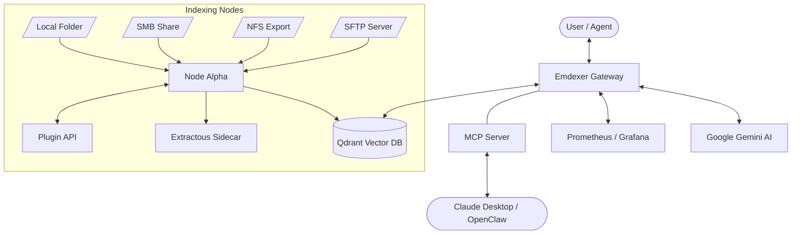

# Emdexer (Network Attached Storage Document EXpert)


Emdexer is a high-performance, multi-node RAG (Retrieval-Augmented Generation) system designed to turn your local storage, NAS, or document archives into a searchable, chat-ready knowledge base.

## The Pattern

The world is a flat circle of unindexed data. Emdexer breaks the loop. It doesn't just find files; it understands the shadows they cast.

## Features

- **Semantic Intelligence:** Multi-hop RAG architecture for deep context synthesis.
- **Stable Identity:** Uses Content-addressable UUID v5 for consistent file tracking across re-indexes.
- **Universal Ingestion:** Native support for Local FS, SMB, NFS, and SFTP.
- **Plugin Architecture:** Extensible extraction API (Go/Python) for custom data formats.
- **Enterprise Observability:** Prometheus/Grafana metrics and structured audit logging.
- **Privacy-First:** Local-first processing with isolated namespaces.
- **Format Agnostic:** Handles PDF, Word, Excel, Images (OCR), Video, and Email via native extractors and Extractous. Supports files up to 50MB per file.

## Architecture



## Quick Start

1. **Configure:** Add your `GOOGLE_API_KEY` and `EMDEX_AUTH_KEY` to `.env`.
2. **Launch:** `docker compose up -d`
3. **Chat:** Connect to the Gateway API or MCP server.

### Configuration

The following environment variables are used to configure Emdexer:

| Variable | Description | Default |
|----------|-------------|---------|
| `EMDEX_PORT` | Port for the Gateway API | `7700` |
| `EMDEX_AUTH_KEY` | Bearer token for API authentication | — |
| `EMDEX_GEMINI_MODEL` | Gemini model for RAG and chat | `gemini-1.5-flash` |
| `GOOGLE_API_KEY` | Your Google AI API key | — |
| `QDRANT_HOST` | Qdrant gRPC endpoint | `localhost:6334` |
| `EMDEX_SEARCH_LIMIT` | Max results for `/v1/search` | `10` |
| `EMDEX_CHAT_LIMIT` | Max results for RAG context | `5` |

For a complete list, see [ARCHITECTURE.md](docs/ARCHITECTURE.md#3-configuration-decoupling).

## Documentation

- [Installation Guide](docs/INSTALL.md)
- [API Reference](docs/API.md)
- [Architecture & Design Decisions](docs/ARCHITECTURE.md)
- [Delivery Plan & Status](PLAN.md)
- [Multi-Node Setup](docker-compose.multi-node.yml)

## Trust Model

Understanding what Emdexer does and does not protect is critical before deploying it.

### What is protected
- **Authentication**: All API endpoints (except `/health*`, `/metrics`) require a Bearer token (`EMDEX_AUTH_KEY`). No token, no access.
- **Namespace isolation**: Every indexed document is tagged with a namespace. Search and RAG queries are hard-filtered to a single namespace. The `/v1/chat/completions` endpoint **requires** the `X-Emdex-Namespace` header — missing namespace returns 400, not a global result.
- **Multi-hop isolation**: Both hops in the RAG pipeline are scoped to the declared namespace. The LLM's query refinement loop cannot escape its namespace boundary.
- **Registry integrity**: Node registrations persist to `nodes.json` with atomic file swaps (no partial writes on crash). Registry reads return deep copies — callers cannot mutate live state.

### What is NOT protected
- **Namespace is not cryptographic**: a client with a valid auth token and knowledge of another namespace name can query it. This is a soft boundary enforced by the gateway, not by encryption.
- **Single shared auth key**: there is one `EMDEX_AUTH_KEY` per gateway deployment. All consumers share the same key. Per-user isolation requires OIDC/JWT (planned for Phase 15.4).
- **No data encryption at rest**: Qdrant stores vectors and payloads in plaintext. Disk encryption (LUKS, dm-crypt, cloud KMS) must be applied at the infrastructure level.
- **No TLS in-process**: the gateway speaks plain HTTP. TLS termination must be handled by a reverse proxy or ingress controller (Traefik, nginx, cloud LB).

### Data Boundaries
```
[Consumer] --Bearer--> [Gateway] --gRPC (internal)--> [Qdrant]
                           |
                           └--HTTPS--> [Gemini API]   ← external call
```

By default, document text is sent to Google's Gemini API for embedding and answering. This means:
- **Document content leaves your infrastructure** on every index and every query.
- If this is unacceptable, see the Air-Gap Roadmap below.

### Air-Gap Roadmap (Phase 15.5)
For deployments where data must never leave the premises:

1. **Local embeddings**: Set `EMBED_PROVIDER=ollama` and configure `OLLAMA_HOST`. The `OllamaProvider` interface is implemented but the HTTP call body is a stub — contribution welcome.
2. **Local LLM**: Replace `callGemini()` in `gateway/main.go` with calls to a local Ollama/vLLM endpoint. The function signature is isolated and the swap is surgical.
3. **Zero-external-call guarantee**: Once both embedding and LLM are local, Emdexer can operate fully air-gapped. The Qdrant instance and all models run on-premises.

Until Phase 15.5 is complete, treat Emdexer as a **cloud-assisted local search** tool, not a fully private one.

---

## Project Goals

To be the standard interface for "Local Intelligence" on personal and enterprise storage systems. Truth is found in the data you forgot you had.

## Licensing

Everything has a price, but for the individual searching for truth in their own data, the path is clear.

- **Individual / Personal Use:** 100% Free. If you're running this on your home NAS or your personal rig, you're good.
- **Enterprise / Commercial Use:** Requires a paid license for companies with > $1M revenue or > 10 employees. Large-scale operations need a different kind of contract.
- **Source Code:** Open for audit and individual use on GitHub. Transparency is the only way to see the shadows.

Licensed under the **Business Source License 1.1**, converting to **Apache 2.0** on January 1st, 2030. See the [LICENSE](LICENSE) file for the fine print.
