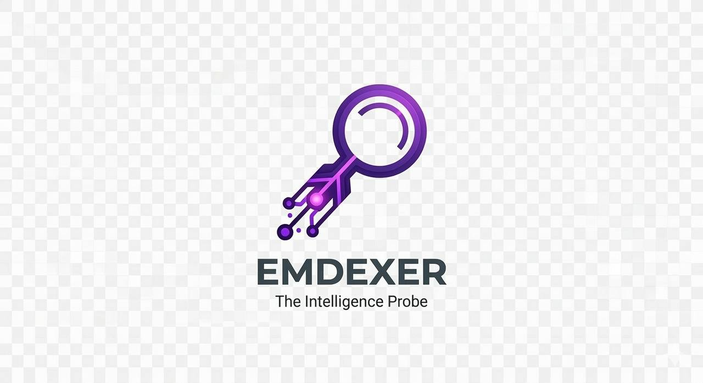
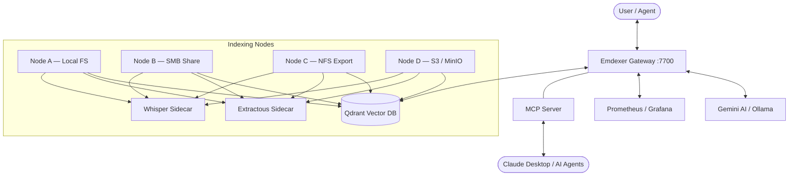

# Emdexer — Distributed RAG Engine for Filesystem Intelligence

<p align="center">
  
</p>

<p align="center">
  <strong>Turn any filesystem — NAS, SMB share, NFS export, SFTP server, or S3 bucket — into a semantic search and AI-powered knowledge base.</strong>
</p>

<p align="center">
  <a href="docs/getting-started/installation.md">Installation</a> · <a href="docs/reference/api.md">API Reference</a> · <a href="docs/design/architecture.md">Architecture</a> · <a href="CONTRIBUTING.md">Contributing</a>
</p>

---

## What Is Emdexer?

Emdexer is an open-source, distributed **Retrieval-Augmented Generation (RAG)** engine written in Go. It indexes documents from heterogeneous filesystems — local disks, SMB/CIFS shares, NFS exports, SFTP servers, and S3/MinIO buckets — into a [Qdrant](https://qdrant.tech/) vector database using Google [Gemini](https://ai.google.dev/) embeddings (or local models via [Ollama](https://ollama.com/)), and exposes an OpenAI-compatible chat completions API with multi-hop semantic search.

**Key differentiator:** Emdexer uses a **Zero-Mount architecture** — lightweight indexing nodes deploy directly where the data lives. No central mount points, no data copying, no network bottlenecks. Only vector embeddings travel to the database.

### Who Is It For?

- **Home lab users** who want to search decades of personal documents on a NAS with natural language.
- **Developers** who need a private AI assistant over local codebases, documentation, and research papers — without sending data to third-party services.
- **Enterprises** that require compliance-ready, air-gap-capable semantic search over internal knowledge bases with strict data sovereignty.

## Core Capabilities

| Capability | Description |
|---|---|
| **Multi-Hop RAG** | Two-hop retrieval pipeline with LLM-driven query refinement. Both hops enforce namespace isolation — no cross-tenant context bleed. |
| **Distributed Indexing** | Deploy lightweight `emdex-node` agents on any storage endpoint. Nodes self-register with the central `emdex-gateway`. |
| **Protocol Agnostic** | Native VFS backends for Local FS, SMB/CIFS, NFS, SFTP, and **S3/MinIO**. No `mount` required. S3 uses Zero-Mount streaming — data flows directly from S3 to memory without touching disk. |
| **Delta-Only Re-indexing** | Three-stage change detection pipeline (stat → partial XXH3 → full XXH3) avoids redundant embedding API calls. |
| **OpenAI-Compatible API** | Drop-in replacement for `/v1/chat/completions`. Works with any OpenAI client SDK, Claude Desktop (via MCP), Telegram, Slack, and Teams. |
| **Format Agnostic** | Handles PDF, DOCX, XLSX, Markdown, HTML, plain text, audio (MP3/WAV/etc.), and video (MP4/MKV/etc.). Multi-modal extraction via [Extractous](https://github.com/yobix-ai/extractous) and [Whisper.cpp](https://github.com/ggerganov/whisper.cpp) sidecars. Zero-RAM streaming for large files. |
| **Stable Document Identity** | Content-addressable UUIDv5 ensures consistent file tracking across re-indexes — no duplicate vectors. |
| **Global Search** | Query all authorized namespaces simultaneously with `namespace=*`. Parallel fan-out with Reciprocal Rank Fusion merging. Results include source namespace citations. |
| **OIDC Identity** | OpenID Connect JWT validation with group-based namespace ACLs. Dual-auth: OIDC first, static API keys as fallback. Fail-secure by design. |
| **Enterprise Observability** | Prometheus metrics, Grafana dashboards, structured JSON audit logging. |
| **Air-Gap Ready** | Swap to `EMBED_PROVIDER=ollama` for fully local embeddings and LLM inference. Zero external API calls. |

## Architecture

Emdexer uses a distributed gateway-node architecture where the gateway handles API requests, search, and RAG, while nodes handle filesystem watching, text extraction, and embedding.



### Dual-Binary Design

| Binary | Role | Deployment |
|---|---|---|
| `emdex-gateway` | API server, search, multi-hop RAG, node registry | Central server |
| `emdex-node` | Filesystem watcher, text extraction, embedding, Qdrant upsert | Deployed where data lives |

Binaries are statically linked (`CGO_ENABLED=0`) — no libc dependency. Runs on any Linux distribution including Alpine, Raspberry Pi OS, and NAS appliances.

## Quick Start

### Docker Compose (recommended)

```bash
git clone https://github.com/piotrlaczykowski/emdexer.git
cd emdexer/deploy/docker

cp ../../.env.example .env
# Edit .env — set GOOGLE_API_KEY and EMDEX_AUTH_KEY

docker compose up -d
```

Services started: Qdrant, Extractous sidecar, Gateway (:7700), Node (:8081), MCP server (:8002).

### Bare Metal

```bash
./scripts/install.sh --all    # Builds, configures, installs systemd services
```

See the full [Installation Guide](docs/getting-started/installation.md) for manual setup, Kubernetes Helm charts, and remote VFS configuration.

### Verify

```bash
# Gateway readiness
curl http://localhost:7700/healthz/readiness

# Semantic search
curl -H "Authorization: Bearer $EMDEX_AUTH_KEY" \
     "http://localhost:7700/v1/search?q=quarterly+budget&namespace=default"

# Chat (OpenAI-compatible)
curl -X POST http://localhost:7700/v1/chat/completions \
     -H "Authorization: Bearer $EMDEX_AUTH_KEY" \
     -H "Content-Type: application/json" \
     -H "X-Emdex-Namespace: default" \
     -d '{"model":"emdexer-v1","messages":[{"role":"user","content":"Summarize the project status."}]}'
```

### Configuration

Key environment variables (see [.env.example](.env.example) for all options):

| Variable | Description | Default |
|----------|-------------|---------|
| `GOOGLE_API_KEY` | Google AI API key for Gemini embeddings and LLM | — |
| `EMDEX_AUTH_KEY` | Bearer token for API authentication | — |
| `EMDEX_GEMINI_MODEL` | Gemini embedding model | `gemini-embedding-2-preview` |
| `EMBED_PROVIDER` | Embedding backend: `gemini` or `ollama` | `gemini` |
| `QDRANT_HOST` | Qdrant gRPC endpoint | `localhost:6334` |
| `EMDEX_PORT` | Gateway HTTP listen port | `7700` |
| `NODE_TYPE` | VFS backend: `local`, `smb`, `nfs`, `sftp`, `s3` | `local` |
| `EMDEX_EXTRACTOUS_URL` | Extractous sidecar endpoint | `http://localhost:8000/extract` |
| `EMDEX_WHISPER_URL` | Whisper.cpp sidecar endpoint | — |
| `EMDEX_ENABLE_OCR` | Enable OCR for images/scanned PDFs | `false` |
| `EMDEX_NAMESPACE` | Namespace tag for indexed vectors | `default` |
| `EMDEX_EMBEDDING_DIMS` | Embedding vector dimensions | `3072` |
| `EMDEX_DELTA_ENABLED` | Checksum-based delta re-indexing | `1` |

For the full configuration reference, see [Architecture → Configuration Decoupling](docs/design/architecture.md#3-configuration-decoupling).

## Documentation

| Document | Description |
|----------|-------------|
| [Installation Guide](docs/getting-started/installation.md) | Bare metal, Docker Compose, Kubernetes Helm |
| [API Reference](docs/reference/api.md) | OpenAI-compatible endpoints, search, health |
| [Architecture](docs/design/architecture.md) | Dual-binary model, VFS abstraction, auth, namespaces |
| [HA Infrastructure](docs/design/ha-infrastructure.md) | Qdrant clustering, gateway replication, PostgreSQL registry |
| [Delta Indexing](docs/design/delta-indexing.md) | Three-stage change detection pipeline |
| [Delivery Plan](PLAN.md) | Roadmap and phase status |
| [Contributing](CONTRIBUTING.md) | Branch strategy, commit conventions, release process |

## Security & Trust Model

Emdexer is designed with security isolation at every layer. Understanding the trust boundaries is critical before deploying in production.

### Protected

- **Dual authentication**: All API endpoints (except `/health*`, `/metrics`) require a Bearer token. The gateway supports two auth modes in priority order:
  1. **OIDC/JWT** (when `OIDC_ISSUER` is configured) — validates JWT signatures via JWKS, extracts user identity (subject, email, groups), and maps groups to namespaces via `EMDEX_GROUP_ACL`.
  2. **Static API keys** (fallback) — `EMDEX_AUTH_KEY` (wildcard) or `EMDEX_API_KEYS` (per-key namespace ACL).
- **Group-based namespace ACLs**: OIDC groups are mapped to namespace lists via `EMDEX_GROUP_ACL` JSON (e.g., `{"hr-admins": ["hr", "hiring"]}`). Namespace intersection is enforced on every search and RAG query.
- **Namespace isolation**: Every indexed document is tagged with a namespace. Search and RAG queries are hard-filtered. The `/v1/chat/completions` endpoint **requires** `X-Emdex-Namespace` — missing namespace returns `400`, not a global result.
- **Multi-hop isolation**: Both retrieval hops in the RAG pipeline are scoped to the declared namespace. The LLM's query refinement loop cannot escape its namespace boundary.
- **Registry integrity**: Node registrations persist atomically to disk. Registry reads return deep copies — callers cannot mutate live state.
- **SSRF protection**: Embedding providers, Extractous sidecar, and S3 VFS all use `safenet.NewSafeTransport()`, blocking connections to RFC 1918, loopback, and link-local addresses at dial time.
- **Fail-secure OIDC**: If `OIDC_ISSUER` is configured but the provider is unreachable at startup, the gateway **refuses to start**.

### Not Protected (by design)

- **Namespace is not cryptographic** — it is a soft boundary enforced by the gateway. OIDC + Group ACLs provide user-level identity but not per-document encryption.
- **No data encryption at rest** — Qdrant stores vectors in plaintext. Apply disk encryption (LUKS, dm-crypt) at the infrastructure level.
- **No TLS in-process** — the gateway speaks plain HTTP. Use a reverse proxy (Nginx, Traefik) for TLS termination.

### Data Boundaries

```
[Consumer] --Bearer--> [Gateway] --gRPC (internal)--> [Qdrant]
                           |
                           └--HTTPS--> [Gemini API]   ← external call
```

By default, document text is sent to the Gemini API for embedding and answering. To keep all data on-premises, set `EMBED_PROVIDER=ollama` and configure a local LLM. See the [Installation Guide](docs/getting-started/installation.md#local-air-gap-embedding-ollama) for air-gap deployment.

## Tech Stack

| Component | Technology |
|---|---|
| Gateway & Node | Go 1.26.1 (statically linked, `CGO_ENABLED=0`) |
| Vector Database | [Qdrant](https://qdrant.tech/) (gRPC, Raft clustering) |
| Embeddings | [Google Gemini](https://ai.google.dev/) or [Ollama](https://ollama.com/) (local) |
| Text Extraction | [Extractous](https://github.com/yobix-ai/extractous) (Python sidecar) |
| MCP Server | Python — Claude Desktop / AI agent integration |
| Change Detection | [XXH3](https://github.com/zeebo/xxh3) (non-cryptographic, SIMD-accelerated) |
| Identity | [OpenID Connect](https://openid.net/) JWT via [go-oidc](https://github.com/coreos/go-oidc) + static API key fallback |
| S3 / Object Storage | [MinIO-Go v7](https://github.com/minio/minio-go) (compatible with AWS S3, DigitalOcean Spaces, Wasabi) |
| Observability | Prometheus, Grafana, structured JSON audit logs |
| Deployment | Docker Compose, Helm (Kubernetes), systemd (bare metal) |

## Licensing

- **Individual / Personal Use:** Free. Run it on your home NAS, your homelab, or your personal machines.
- **Enterprise / Commercial Use:** Requires a paid license for organizations with > $1M revenue or > 10 employees.
- **Source Code:** Open for audit and individual use.

Licensed under the **Business Source License 1.1**, converting to **Apache 2.0** on January 1st, 2030. See [LICENSE](LICENSE) for details.
